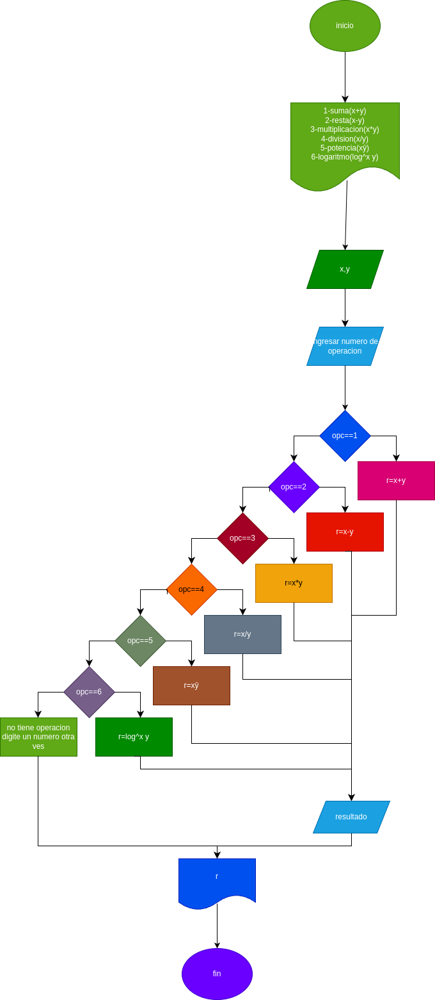

# minicalculadora
calculadora para hacer sumas, restas, multiplicaciones, divisiones, potencias y logaritmos

# analisis

## input

### numero
dijite una operacion e indique el numero para indicare la operacon dada
- 1=suma
- 2=resta
- 3=multiplicacion
- 4=divicion
- 5=potencia
- 6=logaritmo

x = un valor 

y = otro valor
## prossesing
1 = x+y

2 = x-y

3 = x*y

4 = x/y

5 = xŷ

6 = log(x)y

# diseño

# construccion